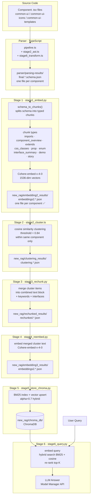

# RAG Pipeline Architecture



## Folder Map

| Folder | Stage | Contents |
|--------|-------|----------|
| `parser/parsing-results/` | Parser out | `final.*.schema.json` — raw component schemas |
| `new_rag/embedding2_results/` | Stage 1 out | `embeddings2.*.json` — per-component typed chunks + vectors |
| `new_rag/clustering_results/` | Stage 2 out | `clustering.*.json` — cluster groups per component |
| `new_rag/rechunked_results/` | Stage 3 out | `rechunked.*.json` — merged cluster text |
| `new_rag/embedding3_results/` | Stage 4 out | `embeddings2.*.json` — re-embedded cluster chunks |
| `new_rag/chroma_db/` | Stage 5 out | ChromaDB vector store |

## Dead Folders (ignore)

| Folder | Reason |
|--------|--------|
| `rag/text-results/` | Old pipeline artifact |
| `new_rag/embedding_results/` | Old monolithic embedding output (all icons in one file) |

## Key Design Rule

Each `embeddings2.*.json` = **exactly one component**.  
Stage 2 processes one file at a time → clustering never crosses component boundaries.
```
